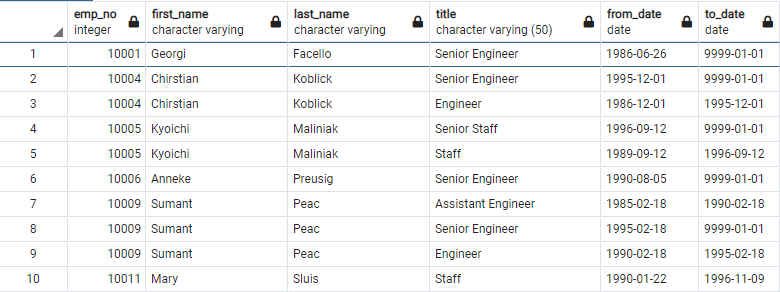
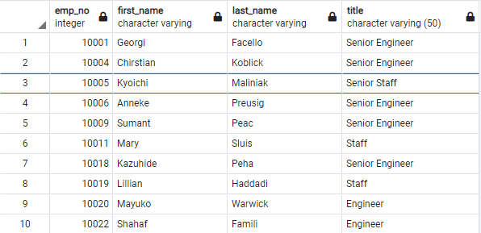

# Pewlett-Hackard-Analysis
An Analysis on Pewlett-Hackard employee database using SQL

## Resources
- Visual Studio Code 1.60.2
- PgAdmin 4
- PostGresSQL 13
- Data files found in "Data" folder

## Summary
Pewlett-Hackard has noticed that they will be experiencing a huge amount of employees that will soon be reaching retirement age. They would like to know which employees are eligible to retire, what their titles are and what employees would be eligible to participate in a mentorship program. This project will help analyze each of the previous inquiries and provide any additional insight that may help Pewlett-Hackard with planning and business strategy.

## Analysis:
Firstly, through SQL, we can identify how we will build queries for this database using an Entity Relationship Diagram (ERD) as seen below: 

This query, seen below, selects all employees who are born between the years 1952 and 1955, marking them eligible for retirement. 

**Retiring Employees**

Unfortunately, in the data above there are duplicates such as "Chirstian Koblick" who has had 2 positions. We will need to isolate for each employee without their duplicate roles in order to get an accurate count. Below is the appropriate count of employees at 90,398. These are the roles that will need to be filled as this generation retires. 

**Unique Titles**

### Retiring Employee Titles
The companies database consists of 7 Titles. Senior Engineer, Senior Staff, Engineer, Staff, Technique Leader, Assistant Engineer and Manager. In total, 90,398 employees have been deemed eligible to retire. As expected, the titles with "senior" in the name make up more than 60% of the employees. These are probably the positions that will need to be replaced the fastest.

**Count and Titles of Eligible Retiring Employees**

### Mentorship Eligibility
This query returned the employees who were born in the year 1965. They are the ones who are eligible for the mentorship. There are 1,549 employees eligible, proving that there are enough mentors for the next generation in the mentorship program. 

**Retiring Employees eligible for Retirement**

## Conclusion
This analysis has shown that there are a large number of employees that are eligible to retire that are either Senior Engineers or Senior Staff. There will need to be a push to hire or promote new employees to fulfill the roles of those retiring. The mentorship program is a good step in the right direction of recruiting talent and training those who can learn from those who have already been at Pewlett-Hackard. But there will need to be a hiring surge to replenish those that will be retiring. With further analysis there also may need to be an assessment on how much each employees retirement pay will be in order to keep an appropriate track of how much money is being paid out versus how much money is being earned by the company. 
